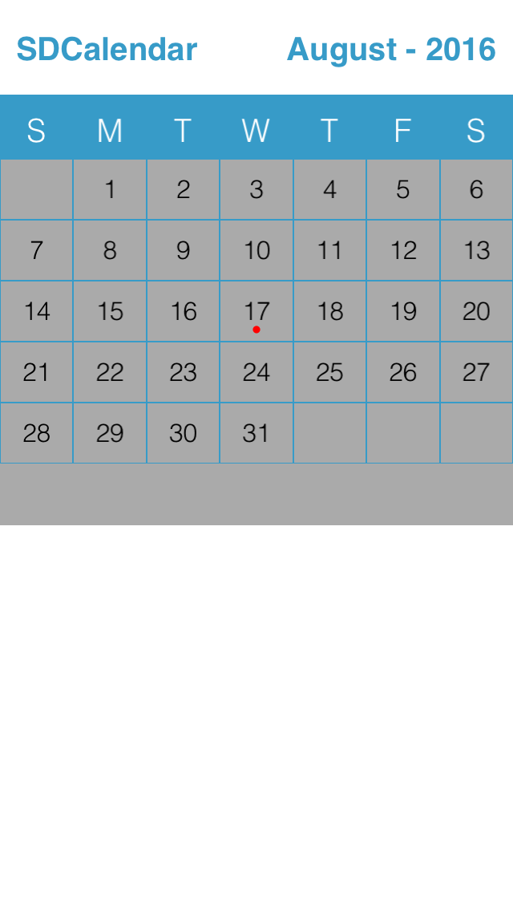

# iphoneapp
Iphone Projects

## SDCalendar
       
SDCalendar is an easy to implement calendar for iOS.
## Installation
Just drag Month View group in your application from the project.
The purpose of this calendar is to show how we can create our own custom calendar with minimum code.
Screenshots
  
## Screenshots



## Warning
•	Gregorian Calendar only
## Features
•	Horizontal swapping on month (Vertical can be possible if you customize it as shown below)
•	Month view mode
•	Color Indicator for particular date 
•	iPad & iPhone Compatibility using code 
## Basic usage
You have to follow the below steps:
•	Swap from left to right or from right to left to navigate between months.


Calendar contains three view listed below
```objective-c
	@property (strong, nonatomic) UIView *viewTitleBar;
	@property (strong,nonatomic) UIView * viewWeekDay;
	@property (strong, nonatomic) UIView *viewCalendarContainer;
```

•	The empty space below calendar can be utilize to show any listing
•	You can list the event with date 
Ex.
```objective-c
	- (void)getEventOfSelectedMonth
	{

	 // add dates with yyyy-MM-dd format

	arrayofEventDate = [[NSMutableArrayalloc] initWithObjects:@"2016-07-08",@"2016-08-17", nil];

	}
```
## Implementation
Just call following methods
```objective-c
	// initialize calendar component

	[selfinitBasicComponant];

	// setinidicator color

	indicatorColor = [UIColorredColor];

	// create month view

	    [selfinitUIComponant];

	// setBackgroundColor to MonthView

	    [selfsetBackgroundColorOfMonthView:[UIColorlightGrayColor]];
```
## Initialize Month with given date
```objective-c
	  [selfinitMonthView:current_date];
```
Generate Month -

•	First of all get number of weeks in the month, so we can determine how many rows we need.

•	Then create each row with 7 columns for completing one week.

•	Generate month view

•		-(void)genrateMonthView:(NSDate*)startDateinView:(UIView*)viewCalBg


Get selected date.
```objective-c
	- (void)getEventOfSelectedDate : (UIButton*)sender
	{

	NSDateFormatter *dateFormatter = [[NSDateFormatteralloc] init];

	    [dateFormattersetDateFormat:@"MM-yyyy"];

	NSString *strMonth = [[dateFormatterstringFromDate:current_date] componentsSeparatedByString:@"-"][0];

	NSString *strYear = [[dateFormatterstringFromDate:current_date] componentsSeparatedByString:@"-"][1];

	NSString *dateStr = [NSStringstringWithFormat:@"%@-%@-%ld",strYear,strMonth,(sender.tag + 2) - weekStartDay];

	NSLog(@"selected date %@",dateStr);
	}
```

## Customize the design
Change calendar’s Theme color by changing THEME_COLOR’s RGB from Constant file.
To change the color of title, month-year as well the background color of the day


Change month background color by calling method

Ex.
```objective-c
	- (void)setBackgroundColorOfMonthView:(UIColor*)color
	{

	    [_viewCalendarBackgroundsetBackgroundColor:color];

	}
```

For customize the design you have to implement some methods depending on what parts you want to custom. To change the event indicator color you need to change the code as shown above.

## Pagination

The calendar can be swipe from any two directions among all four directions.

You can use UISwipeGestureRecognizerDirectionDown for swip_right, 
And UISwipeGestureRecognizerDirectionUp for swip_left,
Instead of right and left direction

Replace below code:
```objective-c
	[swipe_rightsetDirection:(UISwipeGestureRecognizerDirectionRight)];

	[swipe_leftsetDirection:(UISwipeGestureRecognizerDirectionLeft)];
```
With
```objective-c
        [swipe_rightsetDirection:(UISwipeGestureRecognizerDirectionDown)];

        [swipe_leftsetDirection:(UISwipeGestureRecognizerDirectionUp)];
```
## Requirements
•	iOS8 or higher
•	Automatic Reference Counting (ARC)

## Author
	Stark digital Media Services Pvt. Ltd.

## License
SDCalendar is released under the MIT license. See the LICENSE file for more info.
